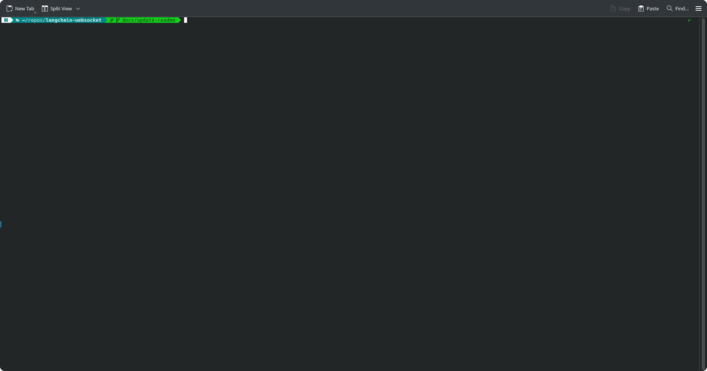

# langchain-websocket

A simple [Starlette](https://www.starlette.io/) application that demonstrates [Langchain runnable streaming](https://python.langchain.com/docs/how_to/streaming/) with websockets, ideal for a chatbot application.



## Setup
Install:
- [uv](https://docs.astral.sh/uv/getting-started/installation/)
- [just](https://github.com/casey/just)
- [wscat](https://github.com/websockets/wscat)
and then run
```bash
just setup
```
which will create a .venv python virtual environment with all dependencies.

## Environment variables
See .env.dist for what you need. Then run
```bash
just env
```
and populate your .env file.

## Running the chatbot
### Server
in one terminal, run
```bash
just run-server
```

you should then see something like:
```bash
uv run uvicorn main:app --host $SERVER_HOST --port $SERVER_PORT --workers 2
INFO:     Uvicorn running on http://127.0.0.1:8080 (Press CTRL+C to quit)
INFO:     Started parent process [1068812]
INFO:     Started server process [1068815]
INFO:     Waiting for application startup.
INFO:     Application startup complete.
INFO:     Started server process [1068814]
INFO:     Waiting for application startup.
INFO:     Application startup complete.
```

in another terminal, run
### Client
```bash
just run-client
```

and you should see something like:
```bash
wscat -c http://$SERVER_HOST:$SERVER_PORT/ws/chat
Connected (press CTRL+C to quit)
>
```

Now in the client terminal, type the subject of the haiku you would like the LLM to generate.
You should soon see streamed responses as the LLM is generating them, all in valid JSON.


```bash
wscat -c http://$SERVER_HOST:$SERVER_PORT/ws/chat
Connected (press CTRL+C to quit)
> bears
< {"source":"bot","message":{},"type":"start"}
< {"source":"bot","message":{},"type":"stream"}
< {"source":"bot","message":{"title":""},"type":"stream"}
< {"source":"bot","message":{"title":"Maj"},"type":"stream"}
< {"source":"bot","message":{"title":"Majestic"},"type":"stream"}
< {"source":"bot","message":{"title":"Majestic Bears"},"type":"stream"}
< {"source":"bot","message":{"title":"Majestic Bears","haiku":""},"type":"stream"}
< {"source":"bot","message":{"title":"Majestic Bears","haiku":"Silent"},"type":"stream"}
< {"source":"bot","message":{"title":"Majestic Bears","haiku":"Silent forest"},"type":"stream"}
< {"source":"bot","message":{"title":"Majestic Bears","haiku":"Silent forest stroll"},"type":"stream"}
< {"source":"bot","message":{"title":"Majestic Bears","haiku":"Silent forest stroll,"},"type":"stream"}
< {"source":"bot","message":{"title":"Majestic Bears","haiku":"Silent forest stroll,  "},"type":"stream"}
< {"source":"bot","message":{"title":"Majestic Bears","haiku":"Silent forest stroll,  \n"},"type":"stream"}
< {"source":"bot","message":{"title":"Majestic Bears","haiku":"Silent forest stroll,  \nP"},"type":"stream"}
< {"source":"bot","message":{"title":"Majestic Bears","haiku":"Silent forest stroll,  \nPaws"},"type":"stream"}
< {"source":"bot","message":{"title":"Majestic Bears","haiku":"Silent forest stroll,  \nPaws tread"},"type":"stream"}
< {"source":"bot","message":{"title":"Majestic Bears","haiku":"Silent forest stroll,  \nPaws tread softly"},"type":"stream"}
< {"source":"bot","message":{"title":"Majestic Bears","haiku":"Silent forest stroll,  \nPaws tread softly on"},"type":"stream"}
< {"source":"bot","message":{"title":"Majestic Bears","haiku":"Silent forest stroll,  \nPaws tread softly on the"},"type":"stream"}
< {"source":"bot","message":{"title":"Majestic Bears","haiku":"Silent forest stroll,  \nPaws tread softly on the ground"},"type":"stream"}
< {"source":"bot","message":{"title":"Majestic Bears","haiku":"Silent forest stroll,  \nPaws tread softly on the ground,"},"type":"stream"}
< {"source":"bot","message":{"title":"Majestic Bears","haiku":"Silent forest stroll,  \nPaws tread softly on the ground,  "},"type":"stream"}
< {"source":"bot","message":{"title":"Majestic Bears","haiku":"Silent forest stroll,  \nPaws tread softly on the ground,  \n"},"type":"stream"}
< {"source":"bot","message":{"title":"Majestic Bears","haiku":"Silent forest stroll,  \nPaws tread softly on the ground,  \nNature"},"type":"stream"}
< {"source":"bot","message":{"title":"Majestic Bears","haiku":"Silent forest stroll,  \nPaws tread softly on the ground,  \nNature's"},"type":"stream"}
< {"source":"bot","message":{"title":"Majestic Bears","haiku":"Silent forest stroll,  \nPaws tread softly on the ground,  \nNature's quiet"},"type":"stream"}
< {"source":"bot","message":{"title":"Majestic Bears","haiku":"Silent forest stroll,  \nPaws tread softly on the ground,  \nNature's quiet kings"},"type":"stream"}
< {"source":"bot","message":{"title":"Majestic Bears","haiku":"Silent forest stroll,  \nPaws tread softly on the ground,  \nNature's quiet kings."},"type":"stream"}
< {"source":"bot","message":{"title":"Majestic Bears","haiku":"Silent forest stroll,  \nPaws tread softly on the ground,  \nNature's quiet kings."},"type":"end"}
```

## Docker
To build a docker image running the webserver, you can run
```bash
just docker-build
```
then to run the docker container, use
```bash
just docker-run
```
